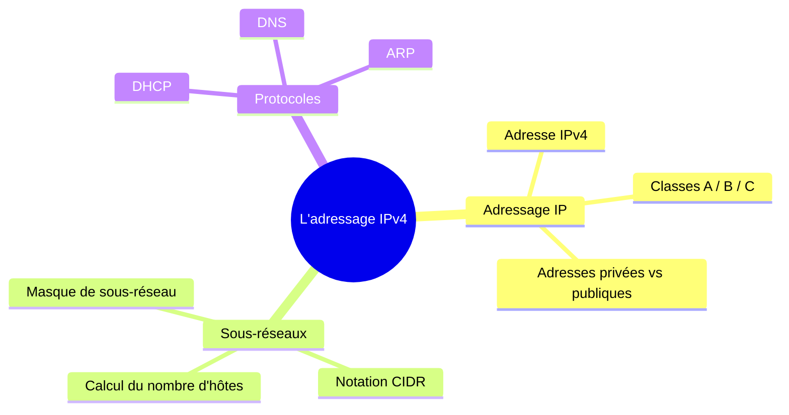

# Module 3 : L'adressage IPv4

*Cours : [Cours 1 - Bases des réseaux](../index.md)*

!!! note "Module d'exemple, déjà rempli"
    Ce module sert de modèle : il montre à quoi doit ressembler un module une fois complété (les 7 sections, dans l'ordre, avec un quiz qui fonctionne). Tous les autres modules du site sont pour l'instant vides (sections "_À compléter_") — reproduis cette structure au fur et à mesure de tes révisions.

## 🎯 Objectif du module

À la fin de ce module, tu dois être capable de :

- Expliquer la structure d'une adresse IPv4 et son rôle ;
- Distinguer un masque de sous-réseau et calculer le nombre d'hôtes disponibles ;
- Différencier une adresse IP privée d'une adresse publique ;
- Citer le rôle des protocoles DHCP, DNS et ARP dans un réseau local.

## 🖼️ Résumé visuel



!!! info "Comment ça marche ?"
    Ce schéma est généré automatiquement à partir de texte (grâce à **Mermaid**, intégré au site) : pas besoin de dessiner une image. Pour créer un diagramme, écris-le en texte dans un bloc ```` ```mermaid ```` — je t'expliquerai la syntaxe le jour où tu voudras en refaire un.

## 📖 Cours consolidé

### L'adresse IPv4

Une adresse IPv4 est codée sur **32 bits**, écrite sous forme de 4 nombres décimaux (0 à 255) séparés par des points, par exemple `192.168.1.10`. Elle se compose de deux parties :

- une partie **réseau**, identique pour toutes les machines du même réseau local ;
- une partie **hôte**, unique à chaque machine du réseau.

C'est le **masque de sous-réseau** qui indique où se situe la frontière entre les deux.

### Classes d'adresses historiques

| Classe | Plage d'adresses | Masque par défaut | Usage typique |
|---|---|---|---|
| A | 1.0.0.0 – 126.255.255.255 | 255.0.0.0 (/8) | Très grands réseaux |
| B | 128.0.0.0 – 191.255.255.255 | 255.255.0.0 (/16) | Réseaux moyens |
| C | 192.0.0.0 – 223.255.255.255 | 255.255.255.0 (/24) | Petits réseaux (le plus courant en entreprise) |

### Adresses privées vs publiques

Les plages suivantes sont **privées** (non routées sur Internet) :

- `10.0.0.0/8`
- `172.16.0.0/12`
- `192.168.0.0/16`

Toute autre adresse publique est, par défaut, routable sur Internet.

### Commandes utiles pour consulter sa configuration IP

=== "Windows (PowerShell)"
    ```powershell
    ipconfig /all
    ```

=== "Linux (Bash)"
    ```bash
    ip a
    ```

## ✅ Points clés à retenir

!!! success "L'essentiel du module"
    - Une adresse IPv4 = 32 bits = partie réseau + partie hôte.
    - Le masque de sous-réseau détermine la frontière réseau/hôte.
    - `/24` = 256 adresses dont 254 utilisables (1 adresse réseau + 1 broadcast).
    - Les plages privées (`10.x`, `172.16-31.x`, `192.168.x`) ne sont jamais routées sur Internet.
    - DHCP attribue une IP automatiquement, DNS traduit un nom en IP, ARP relie une IP à une adresse MAC sur le réseau local.

## 📝 Fiche de révision

- [ ] Je sais découper une adresse IP en partie réseau / partie hôte à partir d'un masque.
- [ ] Je sais calculer le nombre d'hôtes utilisables d'un sous-réseau (`2^n - 2`).
- [ ] Je sais reconnaître si une adresse est privée ou publique.
- [ ] Je sais expliquer en une phrase le rôle de DHCP, DNS et ARP.

**Astuce examen :** pour calculer rapidement le nombre d'hôtes utilisables d'un `/n`, calcule `2^(32-n) - 2`. Exemple pour un `/24` : `2^8 - 2 = 254`.

## 🧠 Quiz — entraîne-toi

<div id="quiz-cours01-module3"></div>

<script type="application/json" id="quiz-cours01-module3-data">
[
  {
    "question": "Combien de bits compose une adresse IPv4 ?",
    "options": ["16 bits", "32 bits", "64 bits"],
    "correctIndex": 1,
    "explanation": "Une adresse IPv4 est codée sur 32 bits, répartis en 4 octets."
  },
  {
    "question": "Quelle plage d'adresses fait partie des adresses privées ?",
    "options": ["8.8.8.0/24", "192.168.0.0/16", "51.15.0.0/16"],
    "correctIndex": 1,
    "explanation": "192.168.0.0/16 fait partie des trois plages réservées aux réseaux privés (avec 10.0.0.0/8 et 172.16.0.0/12)."
  },
  {
    "question": "Quel protocole attribue automatiquement une adresse IP à un poste ?",
    "options": ["DNS", "ARP", "DHCP"],
    "correctIndex": 2,
    "explanation": "DHCP (Dynamic Host Configuration Protocol) distribue automatiquement une configuration IP aux postes du réseau."
  },
  {
    "question": "Combien d'adresses utilisables offre un réseau en /24 ?",
    "options": ["256", "254", "255"],
    "correctIndex": 1,
    "explanation": "Un /24 possède 256 adresses au total, moins l'adresse réseau et l'adresse de broadcast, soit 254 utilisables."
  }
]
</script>

<script>
  document.addEventListener("DOMContentLoaded", function () {
    TSSRQuiz.init({
      containerId: "quiz-cours01-module3",
      dataId: "quiz-cours01-module3-data",
    });
  });
</script>
