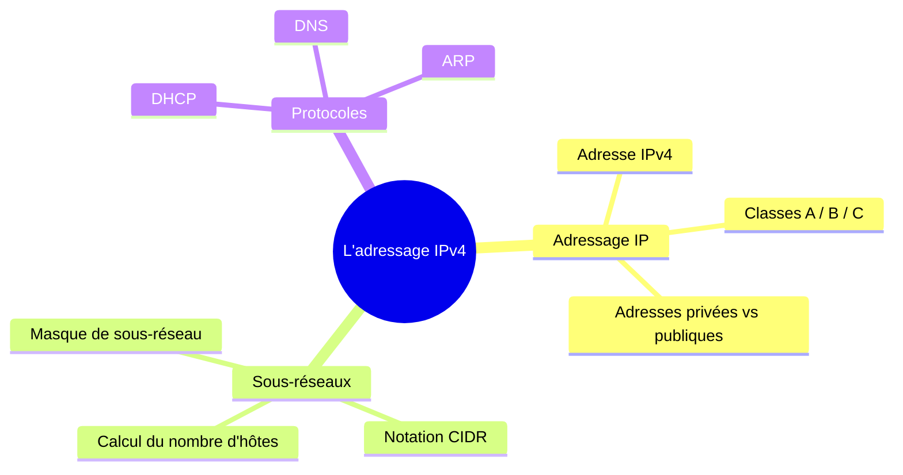

# Module 3 : L'adressage IPv4

*Cours : [Cours 1 - Bases des réseaux](../index.md)*

## 🎯 Objectif du module

Ce module présente la structure d'une adresse IPv4, les classes d'adresses (A à E), le calcul de l'ID réseau via le masque de sous-réseau, la notation CIDR, le sous-réseautage (subnetting), les adresses privées et les adresses APIPA.

## 🖼️ Résumé visuel



!!! info "Comment ça marche ?"
    Ce schéma est généré automatiquement à partir de texte (grâce à **Mermaid**, intégré au site) : pas besoin de dessiner une image. Pour créer un diagramme, écris-le en texte dans un bloc ```` ```mermaid ```` — je t'expliquerai la syntaxe le jour où tu voudras en refaire un.

## 📖 Cours consolidé

## 1. Présentation générale de l'adressage IPv4

Une adresse **IPv4** est constituée de **32 bits**, découpés en **4 octets** (4 × 8 bits), représentés sous forme de 4 nombres décimaux séparés par des points, chacun compris entre 0 et 255.

```
Adresse IP :   192   .   168   .    1    .    1
Binaire   :  11000000.10101000.00000001.00000001
```

Une adresse IPv4 est toujours composée de deux parties :

| Partie | Rôle |
|---|---|
| **ID_Réseau** | Identifie le réseau logique auquel appartient l'adresse |
| **ID_Hôte** | Identifie un appareil unique au sein de ce réseau |

Pour communiquer, un hôte a besoin de **deux informations** : son **adresse IP**, et son **masque de sous-réseau** — c'est la combinaison des deux qui permet de calculer son **adresse de réseau** et son **adresse de diffusion** (broadcast). Voir section 3 pour le détail du calcul.

---

## 2. Les classes d'adresses IPv4

Les adresses IPv4 sont réparties en **5 classes** (A à E), chacune définissant une répartition différente entre bits réseau et bits hôte. Pour identifier la classe d'une adresse, il suffit de regarder son **premier octet**.

| Classe | 1er octet | Bits réseau / hôte | Utilisation | Exemple |
|---|---|---|---|---|
| **A** | 0 à 127 | 8 bits réseau / 24 bits hôte | Très grands réseaux | 10.0.0.1 |
| **B** | 128 à 191 | 16 bits réseau / 16 bits hôte | Réseaux de taille moyenne | 172.16.0.1 |
| **C** | 192 à 223 | 24 bits réseau / 8 bits hôte | Petits réseaux (LAN) | 192.168.1.1 |
| **D** | 224 à 239 | — (pas de schéma réseau/hôte) | Multidiffusion (multicast) | 224.0.0.1 |
| **E** | 240 à 255 | — (pas de schéma réseau/hôte) | Expérimentation, usage futur | 240.0.0.1 |

📌 **Classe A** : la plage **127.0.0.0** est réservée aux boucles locales (voir adresses spéciales ci-dessous), même si elle appartient techniquement à la classe A.

📌 **Classe D** : ne suit pas de découpage réseau/hôte classique — elle sert uniquement à envoyer des paquets vers plusieurs destinataires à la fois.

### Les adresses spéciales

| Adresse | Rôle | Exemple |
|---|---|---|
| **Boucle locale (localhost)** | Tests / communication interne à l'appareil lui-même | 127.0.0.1 |
| **Adresse réseau** | Identifie le réseau lui-même (tous les bits hôte à 0) | 192.168.1.0 |
| **Adresse de diffusion (broadcast)** | Envoie un message à tous les appareils du réseau (tous les bits hôte à 1) | 192.168.1.255 |

---

## 3. Le masque de sous-réseau et le calcul de l'ID réseau

Le **masque de sous-réseau** indique quels bits de l'adresse IP appartiennent à la partie **réseau** (bits à 1) et lesquels appartiennent à la partie **hôte** (bits à 0). C'est lui qui permet de calculer l'**ID réseau** d'une adresse, via une opération logique **ET (AND)** entre l'adresse IP et le masque, bit à bit :

- 1 AND 1 = 1
- 1 AND 0 = 0
- 0 AND 0 = 0

### Exemple : 192.168.1.10 /24

```
Adresse IP :  11000000.10101000.00000001.00001010
Masque /24 :  11111111.11111111.11111111.00000000
              ────────────────────────────────────  (opération AND)
ID Réseau  :  11000000.10101000.00000001.00000000  →  192.168.1.0
```

La partie **hôte** correspond aux bits restants une fois le réseau identifié :

```
Adresse IP :  11000000.10101000.00000001.00001010
ID Réseau  :  11000000.10101000.00000001.00000000
              ────────────────────────────────────
Adresse hôte :                                 10   (en décimal)
```

**Généralisation** : avec un masque **/n**, les **n premiers bits** de l'adresse IP servent à l'ID réseau, et les **32 − n bits restants** identifient l'hôte. Le principe de calcul (conversion en binaire + AND) est **toujours le même**, quelle que soit la plage d'adresses ou le masque utilisé.

---

## 4. La notation CIDR

La notation **CIDR** (*Classless Inter-Domain Routing*) exprime un masque de sous-réseau sous la forme d'un **/nombre**, indiquant combien de bits sont réservés à la partie réseau — par exemple, dans `192.168.1.0/24`, le `/24` signifie que les 24 premiers bits identifient le réseau.

**Pourquoi CIDR ?** Le découpage traditionnel en classes A/B/C attribue des blocs de tailles **fixes**, ce qui gaspille souvent des adresses (une entreprise ayant besoin de 300 adresses devait historiquement prendre un bloc de classe B entier, soit 65 536 adresses). CIDR permet de découper des blocs à la taille **exacte** du besoin (ex. /28, /29...).

### Table de correspondance CIDR ↔ masque décimal

| CIDR | Masque décimal | Bits réseau | Bits hôte | Nb d'hôtes utilisables |
|---|---|---|---|---|
| **/24** | 255.255.255.0 | 24 | 8 | 254 |
| **/26** | 255.255.255.192 | 26 | 6 | 62 |
| **/28** | 255.255.255.240 | 28 | 4 | 14 |

**Exemple** : `192.168.10.0/26` → 26 bits réservés au réseau, 6 bits restants pour l'hôte → 2⁶ = 64 adresses possibles, mais seulement **62 hôtes utilisables** (on retire l'adresse réseau et l'adresse de diffusion).

---

## 5. Le sous-réseautage (subnetting)

Le **sous-réseautage** consiste à diviser un réseau en plusieurs réseaux plus petits, en « empruntant » des bits à la partie hôte pour les affecter à la partie réseau.

**Objectifs** :
- **Optimiser** l'espace d'adressage (moins de gaspillage d'adresses IP).
- **Réduire les domaines de diffusion** (broadcast) → meilleures performances réseau.
- **Segmenter pour sécuriser** : limiter l'accès entre les différents sous-réseaux.

### Les formules à connaître

| Formule | Calcule |
|---|---|
| **2ⁿ** | Le nombre de sous-réseaux possibles (n = nombre de bits empruntés) |
| **2ʰ − 2** | Le nombre d'hôtes utilisables par sous-réseau (h = bits restants pour l'hôte ; on retire l'adresse réseau et l'adresse de diffusion) |

### Exemple 1 — Diviser 192.168.1.0/24 en 2 sous-réseaux

En passant de **/24** à **/25** (on emprunte 1 bit), on obtient 2¹ = **2 sous-réseaux** :

| Sous-réseau | Plage d'adresses |
|---|---|
| Sous-réseau 1 | 192.168.1.0 – 192.168.1.127 |
| Sous-réseau 2 | 192.168.1.128 – 192.168.1.255 |

### Exemple 2 — Diviser 192.168.1.0/24 en 4 sous-réseaux

En passant à **/26** (2 bits empruntés), on obtient 2² = **4 sous-réseaux**, chacun avec 2⁶ − 2 = **62 hôtes** :

| Sous-réseau | Plage d'adresses |
|---|---|
| Sous-réseau 1 | 192.168.1.0 – 192.168.1.63 |
| Sous-réseau 2 | 192.168.1.64 – 192.168.1.127 |
| Sous-réseau 3 | 192.168.1.128 – 192.168.1.191 |
| Sous-réseau 4 | 192.168.1.192 – 192.168.1.255 |

📌 Plus on emprunte de bits pour le réseau, plus on obtient de sous-réseaux — mais chacun contient **moins d'hôtes**. C'est toujours un compromis entre nombre de sous-réseaux et taille de chaque sous-réseau.

---

## 6. Les adresses privées

Les **adresses IP privées** (définies par l'IETF, norme **RFC 1918**) sont réservées aux réseaux internes (domestiques, d'entreprise...) et ne sont **jamais routables sur Internet**.

| Plage | Préfixe CIDR | Nombre d'adresses | Usage typique |
|---|---|---|---|
| 10.0.0.0 – 10.255.255.255 | /8 | 16 777 216 | Grandes entreprises, nombreux sous-réseaux |
| 172.16.0.0 – 172.31.255.255 | /12 | 1 048 576 | Réseaux de taille moyenne |
| 192.168.0.0 – 192.168.255.255 | /16 | 65 536 | Réseaux domestiques, petites entreprises |

**Pourquoi des adresses privées ?**
- **Économie d'adresses publiques** : de nombreux appareils partagent une seule adresse publique grâce au **NAT**.
- **Sécurité** : non routables, donc non directement accessibles depuis l'extérieur.
- **Flexibilité** : facilite la segmentation d'un réseau interne, même à grande échelle.

⚠️ Une adresse privée ne peut pas accéder directement à Internet : elle doit passer par le **NAT** (*Network Address Translation*), qui traduit les adresses privées internes en une adresse publique unique côté Internet — c'est exactement le mécanisme vu au Module 4 (Le routage).

*Exemple concret* : un routeur domestique a une adresse **publique** côté Internet (fournie par le FAI) et une adresse **privée** côté réseau local (ex. 192.168.1.1) ; tous les appareils de la maison reçoivent une adresse dans la plage 192.168.1.x, et le routeur effectue la traduction NAT à chaque accès à Internet.

---

## 7. Les adresses APIPA

Les adresses **APIPA** (*Automatic Private IP Addressing*, standardisées par Microsoft, **RFC 3927**) sont des adresses qu'un appareil **s'attribue lui-même** lorsqu'il ne parvient pas à obtenir d'adresse d'un serveur **DHCP**.

| Caractéristique | Valeur |
|---|---|
| **Plage APIPA** | 169.254.0.0 – 169.254.255.255 |
| **Masque de sous-réseau** | 255.255.0.0 |

**Fonctionnement** : l'appareil choisit une adresse dans la plage APIPA, puis vérifie qu'elle n'est pas déjà utilisée en envoyant une requête **ARP**. Si aucune réponse n'est reçue, l'adresse est attribuée ; sinon, l'appareil en essaie une autre.

⚠️ Une adresse APIPA permet la communication **locale uniquement** (elle n'est pas routable) — **pas d'accès Internet possible**. C'est un signal utile de diagnostic : si un poste a une adresse en `169.254.x.x`, cela indique généralement un problème de serveur DHCP.

*Exemple concret* : dans un bureau où le serveur DHCP tombe en panne, les postes s'auto-attribuent une adresse APIPA et peuvent continuer à partager fichiers/imprimantes entre eux localement, mais perdent l'accès à Internet.

---

## ✅ Points clés à retenir

- Une adresse IPv4 = **32 bits / 4 octets**, toujours composée d'un **ID_Réseau** et d'un **ID_Hôte**.
- 5 classes (**A, B, C, D, E**) identifiables par le **premier octet** — retenir au minimum A (0-127), B (128-191), C (192-223).
- L'**ID réseau** se calcule via un **ET logique** entre l'adresse IP et le masque de sous-réseau, tous deux convertis en binaire.
- **CIDR** (`/n`) remplace le découpage rigide en classes par un découpage à la taille exacte du besoin.
- Sous-réseautage : **2ⁿ** sous-réseaux (n = bits empruntés), **2ʰ − 2** hôtes utilisables par sous-réseau (h = bits hôte restants).
- Les **adresses privées** (RFC 1918 : 10.x, 172.16-31.x, 192.168.x) ne sont jamais routables sur Internet et nécessitent le **NAT**.
- Les **adresses APIPA** (169.254.x.x) signalent une absence de réponse DHCP — communication locale seulement, jamais d'accès Internet.


## 📝 Fiche de révision

- [ ] Je sais découper une adresse IP en partie réseau / partie hôte à partir d'un masque.
- [ ] Je sais calculer le nombre d'hôtes utilisables d'un sous-réseau (`2^n - 2`).
- [ ] Je sais reconnaître si une adresse est privée ou publique.
- [ ] Je sais expliquer en une phrase le rôle de DHCP, DNS et ARP.

**Astuce examen :** pour calculer rapidement le nombre d'hôtes utilisables d'un `/n`, calcule `2^(32-n) - 2`. Exemple pour un `/24` : `2^8 - 2 = 254`.

## 🧠 Quiz — entraîne-toi

<div id="quiz-cours01-module3"></div>

<script type="application/json" id="quiz-cours-01-bases-des-reseaux-module-3-ladressage-ipv4-data">
[
  {
    "question": "Sur combien de bits une adresse IPv4 est-elle codée ?",
    "options": ["32 bits", "16 bits", "64 bits", "128 bits"],
    "correctIndex": 0,
    "explanation": "Une adresse IPv4 est codée sur 32 bits, répartis en 4 octets de 8 bits chacun, ce qui permet 256 valeurs possibles (0 à 255) par octet."
  },
  {
    "question": "À quelle classe appartient l'adresse IP 172.16.0.1 ?",
    "options": ["Classe A", "Classe B", "Classe C", "Classe D"],
    "correctIndex": 1,
    "explanation": "Une adresse est de classe B lorsque son premier octet est compris entre 128 et 191 ; 172 se situe dans cette plage."
  },
  {
    "question": "Quelle plage de valeurs pour le premier octet caractérise une adresse de classe C ?",
    "options": ["0 à 127", "128 à 191", "192 à 223", "224 à 239"],
    "correctIndex": 2,
    "explanation": "Les adresses de classe C ont un premier octet compris entre 192 et 223 ; les trois premiers octets identifient le réseau et le dernier octet identifie l'hôte."
  },
  {
    "question": "À quoi sert l'adresse 127.0.0.1 ?",
    "options": ["C'est une adresse de diffusion pour tout le réseau local", "C'est une adresse réservée au multicast", "C'est l'adresse publique par défaut d'un routeur", "C'est l'adresse de boucle locale (localhost), utilisée pour les tests internes à l'appareil"],
    "correctIndex": 3,
    "explanation": "127.0.0.1 est l'adresse de boucle locale (localhost) : elle permet à un appareil de communiquer avec lui-même, notamment pour des tests, sans passer par le réseau physique."
  },
  {
    "question": "Que permet l'adresse de diffusion (broadcast) d'un réseau, comme 192.168.1.255 pour un réseau de classe C ?",
    "options": ["Envoyer un message à tous les appareils du réseau simultanément", "Identifier un hôte unique sur le réseau", "Chiffrer les communications du réseau", "Router les paquets vers Internet"],
    "correctIndex": 0,
    "explanation": "L'adresse de diffusion permet d'envoyer un message à l'ensemble des appareils connectés à un réseau, contrairement à une adresse d'hôte qui cible un seul appareil."
  },
  {
    "question": "Dans la notation CIDR, que signifie le nombre après le slash (par exemple /24 dans 192.168.1.0/24) ?",
    "options": ["Le nombre total d'hôtes disponibles sur le réseau", "Le nombre de bits réservés à l'identification de la partie réseau", "Le numéro de la classe d'adresse utilisée", "Le nombre d'octets composant l'adresse IP"],
    "correctIndex": 1,
    "explanation": "Le chiffre après le slash indique combien de bits, en partant de la gauche, sont dédiés à la partie réseau de l'adresse ; les bits restants servent à identifier les hôtes."
  },
  {
    "question": "À quel masque de sous-réseau décimal correspond la notation CIDR /24 ?",
    "options": ["255.255.0.0", "255.0.0.0", "255.255.255.0", "255.255.255.192"],
    "correctIndex": 2,
    "explanation": "/24 signifie que les 24 premiers bits sont à 1, ce qui correspond aux trois premiers octets à 255 et au dernier octet à 0, soit 255.255.255.0."
  },
  {
    "question": "Quelle opération logique est utilisée entre l'adresse IP et le masque de sous-réseau pour déterminer l'ID réseau ?",
    "options": ["L'opération OR", "L'opération XOR", "L'opération NOT", "L'opération AND"],
    "correctIndex": 3,
    "explanation": "L'opération AND, bit à bit, entre l'adresse IP et le masque de sous-réseau permet d'obtenir l'identifiant du réseau : le résultat ne vaut 1 que si les deux bits comparés valent 1."
  },
  {
    "question": "Pour l'adresse IP 192.168.1.10 avec un masque /24, quel est l'ID réseau obtenu ?",
    "options": ["192.168.1.0", "192.168.1.10", "192.168.0.0", "192.168.1.255"],
    "correctIndex": 0,
    "explanation": "Avec un masque /24, les trois premiers octets définissent le réseau et le dernier octet est mis à zéro pour obtenir l'ID réseau, soit 192.168.1.0."
  },
  {
    "question": "Quelle plage d'adresses privées correspond à la classe A selon la RFC 1918 ?",
    "options": ["172.16.0.0 à 172.31.255.255", "10.0.0.0 à 10.255.255.255", "192.168.0.0 à 192.168.255.255", "169.254.0.0 à 169.254.255.255"],
    "correctIndex": 1,
    "explanation": "La RFC 1918 réserve la plage 10.0.0.0 à 10.255.255.255 (préfixe /8) comme plage privée de classe A, souvent utilisée dans les grandes entreprises nécessitant de nombreux sous-réseaux."
  },
  {
    "question": "Pourquoi une adresse IP privée ne peut-elle pas être atteinte directement depuis Internet ?",
    "options": ["Parce qu'elle est automatiquement chiffrée par le pare-feu", "Parce qu'elle change toutes les 24 heures", "Parce qu'elle n'est pas routable sur Internet et nécessite une traduction NAT pour communiquer vers l'extérieur", "Parce qu'elle n'est valable que pour les connexions Wi-Fi"],
    "correctIndex": 2,
    "explanation": "Les adresses privées ne sont pas routées sur Internet ; un appareil qui en possède une doit passer par le NAT (Network Address Translation) de son routeur, qui la traduit en adresse IP publique pour communiquer vers l'extérieur."
  },
  {
    "question": "Dans quel contexte un appareil s'attribue-t-il automatiquement une adresse APIPA ?",
    "options": ["Lorsqu'il détecte une attaque réseau", "Lorsqu'il se connecte à Internet pour la première fois", "Lorsqu'un administrateur configure une adresse statique", "Lorsqu'il ne parvient pas à obtenir d'adresse IP d'un serveur DHCP"],
    "correctIndex": 3,
    "explanation": "APIPA (Automatic Private IP Addressing) permet à un appareil de s'auto-attribuer une adresse dans la plage réservée 169.254.0.0/16 lorsqu'aucun serveur DHCP ne répond, afin de maintenir une communication locale."
  },
  {
    "question": "Quelle est la plage d'adresses réservée au mécanisme APIPA ?",
    "options": ["169.254.0.0 à 169.254.255.255", "127.0.0.0 à 127.255.255.255", "10.0.0.0 à 10.255.255.255", "192.168.0.0 à 192.168.255.255"],
    "correctIndex": 0,
    "explanation": "APIPA choisit une adresse dans la plage réservée 169.254.0.0 à 169.254.255.255, avec un masque de sous-réseau 255.255.0.0, lorsqu'aucune réponse DHCP n'est reçue."
  },
  {
    "question": "Un appareil disposant uniquement d'une adresse APIPA peut-il accéder à Internet ?",
    "options": ["Oui, sans aucune restriction", "Non, car les adresses APIPA ne sont pas routables au-delà du réseau local", "Oui, mais uniquement en HTTPS", "Oui, à condition d'utiliser un VPN"],
    "correctIndex": 1,
    "explanation": "Les adresses APIPA permettent uniquement la communication locale entre appareils du même réseau ; elles ne sont pas routables, donc aucun accès à Internet ou à d'autres réseaux externes n'est possible."
  },
  {
    "question": "Que permet le sous-réseautage (subnetting) dans un réseau IPv4 ?",
    "options": ["Augmenter automatiquement le nombre d'adresses IP publiques disponibles", "Remplacer le protocole IPv4 par IPv6", "Diviser un réseau en plusieurs sous-réseaux plus petits pour optimiser l'adressage, la sécurité et les performances", "Chiffrer l'ensemble du trafic réseau"],
    "correctIndex": 2,
    "explanation": "Le sous-réseautage divise un grand réseau en sous-réseaux plus petits, ce qui optimise l'utilisation des adresses, réduit la taille des domaines de diffusion et facilite le contrôle de la sécurité entre segments."
  },
  {
    "question": "Dans le calcul du sous-réseautage, comment crée-t-on des sous-réseaux supplémentaires à partir d'un réseau existant ?",
    "options": ["En empruntant des bits à la partie réseau pour les affecter à la partie hôte", "En ajoutant un cinquième octet à l'adresse IP", "En dupliquant l'adresse réseau existante", "En empruntant des bits à la partie hôte pour les affecter à la partie réseau"],
    "correctIndex": 3,
    "explanation": "Créer des sous-réseaux consiste à « emprunter » un ou plusieurs bits de la partie hôte du masque pour les utiliser dans l'identification de sous-réseaux distincts, ce qui augmente le nombre de réseaux au détriment du nombre d'hôtes par réseau."
  },
  {
    "question": "Avec un masque /26 sur un réseau 192.168.1.0, combien de sous-réseaux et d'hôtes utilisables par sous-réseau obtient-on ?",
    "options": ["4 sous-réseaux de 62 hôtes chacun", "2 sous-réseaux de 126 hôtes chacun", "8 sous-réseaux de 30 hôtes chacun", "4 sous-réseaux de 64 hôtes chacun"],
    "correctIndex": 0,
    "explanation": "Un masque /26 emprunte 2 bits à la partie hôte du /24 d'origine, ce qui donne 2² = 4 sous-réseaux, chacun disposant de 2⁶ - 2 = 62 hôtes utilisables (on retranche l'adresse réseau et l'adresse de diffusion)."
  },
  {
    "question": "Pourquoi retranche-t-on systématiquement 2 adresses au nombre total d'adresses d'un sous-réseau pour obtenir le nombre d'hôtes utilisables ?",
    "options": ["Parce que deux adresses sont toujours réservées au serveur DHCP", "Parce que la première adresse identifie le réseau et la dernière sert d'adresse de diffusion, toutes deux non attribuables à un hôte", "Parce que le masque de sous-réseau occupe deux adresses supplémentaires", "Parce que deux adresses sont réservées aux adresses APIPA"],
    "correctIndex": 1,
    "explanation": "Dans chaque sous-réseau, la première adresse désigne le réseau lui-même et la dernière est l'adresse de diffusion (broadcast) ; ces deux adresses ne peuvent pas être attribuées à un hôte, d'où la formule 2^n - 2."
  },
  {
    "question": "Pourquoi la notation CIDR a-t-elle été introduite en remplacement de l'adressage par classes traditionnel (A, B, C) ?",
    "options": ["Pour remplacer définitivement les adresses IPv4 par des adresses IPv6", "Pour supprimer la nécessité d'un masque de sous-réseau", "Pour permettre un découpage plus flexible des réseaux et limiter le gaspillage d'adresses IPv4", "Pour imposer un nombre fixe de 256 adresses par réseau"],
    "correctIndex": 2,
    "explanation": "L'adressage par classes attribuait des blocs de taille fixe, ce qui gaspillait souvent des adresses. La notation CIDR permet de définir des sous-réseaux de tailles adaptées aux besoins réels, optimisant ainsi l'espace d'adressage IPv4."
  },
  {
    "question": "Quels sont les deux éléments dont un hôte a besoin pour calculer son adresse de réseau logique et son adresse de diffusion ?",
    "options": ["Son adresse MAC et son adresse IP", "Son masque de sous-réseau et l'adresse de sa passerelle par défaut", "Son adresse IP et l'adresse du serveur DNS", "Son adresse IP et son masque de sous-réseau"],
    "correctIndex": 3,
    "explanation": "À partir de son adresse IP et de son masque de sous-réseau, un hôte peut déterminer, via une opération AND, son adresse de réseau logique ainsi que son adresse de diffusion."
  }
]
</script>


<script>
  document.addEventListener("DOMContentLoaded", function () {
    TSSRQuiz.init({
      containerId: "quiz-cours01-module3",
      dataId: "quiz-cours01-module3-data",
    });
  });
</script>
