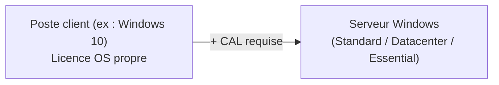

# Module 1 : Administration Windows

*Cours : [Cours 8 - Les services réseau en environnement Microsoft](../index.md)*

## 🎯 Objectif du module

Ce module pose les bases de l'administration d'un serveur Windows : les versions et licences disponibles, les services que l'on peut installer, les modes d'installation, la gestion des rôles/fonctionnalités, la gestion du stockage (partitionnement, disques, RAID) et le formatage.

## 🖼️ Résumé visuel

_À compléter. Tu peux utiliser un diagramme Mermaid — voir un exemple de syntaxe dans le module [L'adressage IPv4](../../cours-01-bases-des-reseaux/module-3-l-adressage-ipv4/index.md)._

## 📖 Cours consolidé

## 1. Versions des systèmes d'exploitation Microsoft

Microsoft propose deux grandes familles de systèmes d'exploitation :

- **Côté serveur** : Windows Server 2019 (version étudiée dans ce module), et des versions plus anciennes comme Windows Server 2008 R2 ou 2016.
- **Côté client** : Windows 10, Windows XP, etc.

### Les éditions de Windows Server

Chaque version de Windows Server (ex. 2019) existe en plusieurs éditions :

| Édition | Caractéristiques |
|---|---|
| **Standard** | Édition de référence utilisée dans ce module |
| **Datacenter** | Le plus de fonctionnalités (contextes de virtualisation intensive, datacenters) |
| **Essential** | Fonctionnalités réduites, marge de manœuvre limitée |

Les serveurs reçoivent régulièrement des **releases / patch notes** qui sécurisent le système et apportent des améliorations.

---

## 2. Licences et CAL

- Chaque poste client (ex. Windows 10) possède **sa propre licence** de système d'exploitation.
- Pour qu'un poste client se connecte à un serveur Windows, il faut en plus une **CAL (Client Access License)**.
- La CAL est une licence numérique qui autorise légalement la connexion d'un client à un serveur lui-même sous licence (Standard, Datacenter ou Essential).

👉 À retenir : **licence OS du poste ≠ CAL**. Les deux sont nécessaires pour un accès complet et légal aux services du serveur.


> Chaque client a sa propre licence OS **et** a besoin d'une **CAL** pour être autorisé à se connecter à un serveur licencié.


---

## 3. Les services pris en charge par Windows Server

L'installation d'un serveur en entreprise permet de déployer plusieurs services qui facilitent la gestion de l'infrastructure (éventuellement complétés par des logiciels tiers comme Windows SQL).

| Service | Rôle |
|---|---|
| **Active Directory** | Gestion centralisée des identités/utilisateurs dans un domaine |
| **DNS** (Domain Name System) | Gestion des noms de domaine |
| **DHCP** (Dynamic Host Configuration Protocol) | Attribution dynamique des adresses IP |
| **WSUS** (Windows Server Update Services) | Gestion centralisée des mises à jour |
| **Hyper-V** | Virtualisation de serveurs |
| **WDS** (Windows Deployment Service) | Déploiement d'OS à travers le réseau |
| **Services d'impression/numérisation** | Gestion centralisée des périphériques d'impression |

Installation d'un rôle en PowerShell (exemple avec AD) :
```powershell
Install-WindowsFeature AD-Domain-Services
```

---

## 4. Les modes d'installation de Windows Server

Deux modes possibles à l'installation :

### Installation standard (avec GUI)
- Environnement graphique complet, proche de l'expérience client (menu démarrer, invite de commandes, etc.)

### Mode Core
- Installation minimale, **sans interface graphique**.
- Mode par défaut depuis Windows Server 2008.
- Avantage majeur : très peu de ressources nécessaires (**512 Mo de RAM suffisent**).
- Seules les **commandes PowerShell** fonctionnent dans ce mode → sa maîtrise est indispensable si on choisit ce mode.

```powershell
Get-Service
```

📌 Point de vigilance à l'installation : cliquer trop vite sur "Suivant" sans choisir "Expérience de bureau" bascule automatiquement en mode Core.

---

## 5. Les rôles et fonctionnalités

Deux façons de les installer :
- Via le **gestionnaire de serveur** (dashboard graphique)
- Via **PowerShell** (obligatoire en mode Core, puisqu'il n'y a pas de dashboard)

| Notion | Définition |
|---|---|
| **Rôle** | Service fourni à des clients (ex. service de fichiers, IIS) |
| **Fonctionnalité** | Outil/composant complémentaire, utile aux éléments sur lesquels on l'ajoute (ex. support de langue) |

Exemple d'installation via PowerShell :
```powershell
Install-WindowsFeature -Name Web-Server -IncludeManagementTools
```

**Étapes clés lors de l'ajout d'un rôle via le gestionnaire de serveur** (ex. IIS) :
1. Gérer → Ajouter des rôles et fonctionnalités
2. Vérification des prérequis (mot de passe fort, IP statique, MàJ Windows Update)
3. Sélection du rôle (+ ajout des dépendances proposées)
4. Sélection des fonctionnalités complémentaires (ex. Sauvegarde Windows Server)
5. Récapitulatif → Installation → redémarrage si nécessaire

---

## 6. Les outils de gestion de Windows Server

| Outil | Usage |
|---|---|
| **Gestionnaire de serveur (dashboard)** | Élément central de l'administration graphique |
| **Consoles MMC** (Microsoft Management Console) | Consoles dédiées par rôle, installables même sur des postes qui n'ont pas le rôle ; disponibles aussi sous Windows Client |
| **CMD** | Actions simples en ligne de commande |
| **PowerShell** | Actions avancées, seul outil disponible en mode Core |

```powershell
Get-Service   # liste tous les services en cours d'exécution
```

---

## 7. Gestion du stockage et tables de partitionnement

### MBR vs GPT

| | **MBR** (Master Boot Record) | **GPT** (GUID Partition Table) |
|---|---|---|
| Ancienneté | Format historique | Format plus récent |
| Compatible avec | BIOS Legacy | BIOS UEFI |
| Tolérance aux pannes | Faible (dépend du 1er secteur physique du disque) | Meilleure (duplication des données sur plusieurs secteurs) |
| Remarque | — | Souvent préconfiguré sur les SSD, optimisé 64 bits |

➡️ Conversion possible **MBR → GPT**, mais uniquement si le disque ne contient **aucune donnée**.

### Disques de base vs disques dynamiques

| | **Disque de base** | **Disque dynamique** |
|---|---|---|
| Structure | Partitions | Volumes |
| RAID logiciel possible ? | ❌ Non | ✅ Oui (RAID Windows) |
| Conversion | Base → Dynamique : pas de perte de données | Dynamique → Base : nécessite de supprimer les volumes au préalable |


📌 En entreprise, on parle plutôt de **RAID matériel** (carte RAID dédiée) plutôt que de RAID logiciel (Windows).

### Limites du disque de base

- Maximum **4 partitions principales**, ou **3 principales + 1 étendue** (avec lecteurs logiques).
- Impossible d'installer un OS sur un lecteur logique.
- Les partitions peuvent être étendues/réduites sur l'espace contigu du même disque.

### Les types de volumes sur disque dynamique

| Volume | Nb disques | Description |
|---|---|---|
| **Simple** | 1 | Le seul type utilisant un seul disque physique |
| **Fractionné** | ≥ 2 | Étend un volume sur plusieurs disques physiques |
| **Agrégé par bandes (RAID 0)** | 2 | Rapidité d'écriture, mais **aucune tolérance de panne** |
| **En miroir (RAID 1)** | 2 | Tolérance de panne, données dupliquées |
| **Agrégé par bandes avec parité (RAID 5)** | ≥ 3 | Compromis performance / sécurité |

---

## 8. Le RAID (Redundant Array of Independent/Inexpensive Disks)

> ⚠️ **Le RAID n'est pas un backup !** Il protège contre la panne matérielle d'un disque, pas contre une suppression accidentelle ou un ransomware.

Logique : si un disque tombe en panne, on a le temps de le remplacer pendant que le service continue de fonctionner pour les utilisateurs.

| RAID | Fonctionnement | Disques min. | Capacité utile | Tolérance de panne |
|---|---|---|---|---|
| **RAID 0** (striping) | Données réparties sur tous les disques | 2 | 100 % | ❌ Aucune |
| **RAID 1** (mirroring) | Données dupliquées à l'identique | 2 | 50 % | ✅ 1 disque (reconstruction = recopie) |
| **RAID 5** (striping + parité) | Données + parité réparties sur tous les disques | 3 | (n-1)/n | ✅ 1 disque (reconstruction = calcul) |
| **RAID 6** (double parité) | Comme RAID 5 mais 2 parités | 4 | (n-2)/n | ✅✅ 2 disques simultanément |
| **RAID 10** (1+0) | Mirroring puis striping | 4 | 50 % | ✅ Bonne tolérance + bonnes perfs |

*(Le détail du mécanisme de parité et du calcul XOR est disponible dans la fiche de révision RAID dédiée.)*

---

## 9. Formatage et systèmes de fichiers

| Système de fichiers | Depuis | Taille max fichier | Taille max partition |
|---|---|---|---|
| **FAT32** | Windows 9x | 4 Go | 2 To |
| **NTFS** | Windows NT | 256 To | ~ similaire |
| **ReFS** | Windows 2012 (espaces de stockage) | — | — |

NTFS est la norme actuelle utilisée en administration Windows Server.

### Processus d'initialisation / formatage d'un disque

1. **Initialiser** le disque (choix MBR/GPT)
2. **Créer** les partitions
3. **Formater** les partitions
4. **Intégrer** les données


### Outils associés

| Outil | Type |
|---|---|
| `diskpart` | CMD |
| `diskmgmt.msc` | Console MMC graphique (Windows + R) |
| `Get-Command -Module Storage` | PowerShell |

Commandes utiles avec `diskpart` :
```
diskpart
list disk
```

---

## ✅ Points clés à retenir

- Une **CAL** est indispensable en plus de la licence OS du poste client pour accéder à un serveur.
- Le **mode Core** est plus léger en ressources mais impose PowerShell.
- **Rôle** = service rendu à des clients ; **fonctionnalité** = outil complémentaire.
- **GPT** > **MBR** en tolérance de panne et compatibilité UEFI/64 bits, mais conversion MBR→GPT seulement sur disque vide.
- Le **RAID logiciel Windows nécessite des disques dynamiques** (volumes), pas des disques de base (partitions).
- Le **RAID n'est pas un backup**.
- **NTFS** est le système de fichiers de référence aujourd'hui (vs FAT32 obsolète et ReFS plus spécifique).

## 📝 Fiche de révision

_À compléter._

## 🧠 Quiz — entraîne-toi

<div id="quiz-cours-08-les-services-reseau-en-environnement-microsoft-module-1-administration-windows"></div>

<script type="application/json" id="quiz-cours-08-les-services-reseau-en-environnement-microsoft-module-1-administration-windows-data">
[
  {
    "question": "Quelle affirmation est correcte concernant les éditions de Windows Server ?",
    "options": [
      "L'édition Datacenter propose davantage de fonctionnalités que l'édition Standard, tandis que l'édition Essential offre des fonctionnalités réduites",
      "L'édition Essential propose plus de fonctionnalités que l'édition Datacenter",
      "Seule l'édition Standard peut héberger un rôle Active Directory",
      "Il n'existe qu'une seule édition de Windows Server, sans distinction de fonctionnalités"
    ],
    "correctIndex": 0,
    "explanation": "Trois éditions principales coexistent : Standard (la version de référence), Datacenter (fonctionnalités étendues, adaptée aux grandes infrastructures) et Essential (fonctionnalités réduites, marge de manœuvre plus limitée)."
  },
  {
    "question": "Qu'est-ce qu'une CAL (Client Access License) ?",
    "options": [
      "Un protocole utilisé pour chiffrer les échanges entre un client et un contrôleur de domaine",
      "Une licence qui autorise légalement un poste client à se connecter à un serveur lui-même sous licence appropriée",
      "Un composant matériel requis pour installer un rôle sur Windows Server",
      "Un outil de sauvegarde intégré au gestionnaire de serveur"
    ],
    "correctIndex": 1,
    "explanation": "En plus de la licence de son propre système d'exploitation, un poste client a besoin d'une CAL pour être autorisé à se connecter à un serveur Windows sous licence (Standard, Datacenter ou Essential)."
  },
  {
    "question": "Parmi les services suivants pris en charge par Windows Server, lequel est spécifiquement dédié à la gestion centralisée des mises à jour système ?",
    "options": [
      "Hyper-V",
      "WDS (Windows Deployment Service)",
      "WSUS (Windows Server Update Services)",
      "Le service de fichiers"
    ],
    "correctIndex": 2,
    "explanation": "WSUS centralise la distribution et la gestion des mises à jour Windows pour l'ensemble des postes et serveurs du réseau, alors que Hyper-V sert à la virtualisation et WDS au déploiement de systèmes d'exploitation."
  },
  {
    "question": "À quoi sert le service WDS (Windows Deployment Service) ?",
    "options": [
      "À attribuer dynamiquement des adresses IP aux postes du réseau",
      "À gérer les noms de domaine du réseau",
      "À centraliser la gestion des mises à jour de sécurité",
      "Au déploiement de systèmes d'exploitation Windows à travers le réseau"
    ],
    "correctIndex": 3,
    "explanation": "WDS permet de déployer un système d'exploitation Windows sur plusieurs postes directement via le réseau, plutôt que d'installer chaque machine individuellement depuis un support physique."
  },
  {
    "question": "Quelle quantité minimale de RAM permet de faire fonctionner Windows Server en mode Core ?",
    "options": [
      "512 Mo",
      "1 Go",
      "2 Go",
      "4 Go"
    ],
    "correctIndex": 0,
    "explanation": "L'absence d'interface graphique en mode Core allège considérablement les ressources nécessaires : 512 Mo de RAM suffisent à le faire fonctionner, contre davantage pour une installation standard avec GUI."
  },
  {
    "question": "Quelle est la particularité du mode d'installation Core de Windows Server par rapport au mode standard ?",
    "options": [
      "Il propose une interface graphique simplifiée mais toujours accessible",
      "Il est dépourvu d'interface graphique et nécessite la maîtrise de PowerShell pour l'administrer",
      "Il ne permet d'installer aucun rôle serveur",
      "Il est réservé exclusivement aux machines virtuelles"
    ],
    "correctIndex": 1,
    "explanation": "Le mode Core est une installation minimale sans interface graphique : seules les commandes PowerShell permettent d'y opérer, ce qui impose d'en maîtriser l'usage pour administrer le serveur."
  },
  {
    "question": "Quelle est la différence fondamentale entre un rôle et une fonctionnalité sous Windows Server ?",
    "options": [
      "Un rôle ne peut être installé que via PowerShell, une fonctionnalité uniquement via le gestionnaire de serveur",
      "Une fonctionnalité nécessite toujours l'installation préalable d'un rôle",
      "Un rôle correspond à un service fourni aux clients, tandis qu'une fonctionnalité est un outil ou composant complémentaire utile aux éléments sur lesquels elle est ajoutée",
      "Il n'existe aucune différence, les deux termes désignent la même chose"
    ],
    "correctIndex": 2,
    "explanation": "Un rôle (comme le service de fichiers ou IIS) exécute des tâches destinées à des clients. Une fonctionnalité (comme un support de langage ou la sauvegarde Windows Server) enrichit ou complète les éléments sur lesquels elle est installée."
  },
  {
    "question": "Quelle commande PowerShell permet d'installer un rôle ou une fonctionnalité sur Windows Server ?",
    "options": [
      "Add-WindowsRole",
      "New-ServerFeature",
      "Enable-WindowsRole",
      "Install-WindowsFeature"
    ],
    "correctIndex": 3,
    "explanation": "La cmdlet Install-WindowsFeature (par exemple Install-WindowsFeature AD-Domain-Services) permet d'installer un rôle ou une fonctionnalité, ce qui est indispensable en mode Core où le gestionnaire de serveur graphique n'est pas disponible."
  },
  {
    "question": "Concernant les consoles MMC de gestion des rôles Windows Server, quelle affirmation est exacte ?",
    "options": [
      "Elles peuvent être installées sur un poste d'administration distinct, même si le rôle correspondant n'y est pas installé",
      "Elles ne fonctionnent que directement sur le serveur hébergeant le rôle",
      "Elles sont uniquement disponibles en mode Core",
      "Elles remplacent entièrement PowerShell pour toutes les tâches d'administration"
    ],
    "correctIndex": 0,
    "explanation": "Les consoles MMC (Microsoft Management Console) peuvent être installées sur un poste d'administration dédié, y compris un client Windows, sans que le rôle correspondant y soit installé, ce qui facilite l'administration à distance."
  },
  {
    "question": "Quel format de table de partitionnement repose sur le BIOS Legacy et constitue le format historique ?",
    "options": [
      "GPT",
      "MBR",
      "ReFS",
      "NTFS"
    ],
    "correctIndex": 1,
    "explanation": "Le MBR (Master Boot Record) est le format historique de partitionnement, lié au BIOS Legacy, tandis que le GPT (GUID Partition Table), plus récent, est associé au BIOS UEFI."
  },
  {
    "question": "Pourquoi le format GPT offre-t-il une meilleure tolérance aux pannes que le format MBR ?",
    "options": [
      "Parce qu'il chiffre systématiquement les données du disque",
      "Parce qu'il ne peut être utilisé que sur des disques SSD",
      "Parce qu'il duplique les données sur plusieurs secteurs, permettant leur reconstruction en cas de défaillance",
      "Parce qu'il limite le nombre de partitions à une seule par disque"
    ],
    "correctIndex": 2,
    "explanation": "Le MBR est fragilisé par sa dépendance au premier secteur physique du disque. Le GPT duplique les données de partitionnement sur plusieurs secteurs, ce qui permet de les reconstruire en cas de défaillance d'une partie du disque."
  },
  {
    "question": "Quelle est la différence entre un disque de base et un disque dynamique ?",
    "options": [
      "Un disque dynamique ne peut contenir aucune donnée utilisateur",
      "Un disque de base ne peut jamais être converti en disque dynamique",
      "Les deux types de disques fonctionnent de manière strictement identique",
      "Un disque de base organise les données en partitions, tandis qu'un disque dynamique les organise en volumes, notamment nécessaires pour le RAID logiciel"
    ],
    "correctIndex": 3,
    "explanation": "Un disque de base repose sur des partitions classiques (C, D...). Un disque dynamique repose sur des volumes, une structure indispensable pour mettre en place du RAID logiciel sous Windows."
  },
  {
    "question": "Combien de partitions principales maximum un disque de base peut-il contenir (en l'absence de partition étendue) ?",
    "options": [
      "4",
      "2",
      "6",
      "8"
    ],
    "correctIndex": 0,
    "explanation": "Un disque de base accepte au maximum 4 partitions principales, ou bien 3 partitions principales associées à une partition étendue pouvant elle-même contenir des lecteurs logiques (non utilisables pour installer un système d'exploitation)."
  },
  {
    "question": "Quel type de volume sur disque dynamique répartit les données sur au moins deux disques de taille identique, offre de bonnes performances en écriture, mais n'apporte aucune tolérance de panne ?",
    "options": [
      "Le volume en miroir (RAID 1)",
      "Le volume agrégé par bandes (RAID 0)",
      "Le volume agrégé par bandes avec parité (RAID 5)",
      "Le volume simple"
    ],
    "correctIndex": 1,
    "explanation": "Le volume agrégé par bandes (RAID 0) répartit les données sur au moins deux disques de taille égale et accélère les écritures, mais la perte d'un seul disque entraîne la perte de l'intégralité des données, faute de redondance."
  },
  {
    "question": "Concernant le RAID 1 (volume miroir), quelle affirmation est exacte ?",
    "options": [
      "Il nécessite un minimum de trois disques",
      "Il permet d'obtenir une capacité logique égale à la somme des deux disques utilisés",
      "Les données sont écrites simultanément sur deux disques identiques en taille, ce qui limite la capacité logique utile à celle d'un seul disque",
      "Il ne tolère aucune panne de disque"
    ],
    "correctIndex": 2,
    "explanation": "En RAID 1, chaque donnée est dupliquée sur les deux disques en temps réel. Deux disques de 100 Go n'offrent donc que 100 Go de capacité logique utile, en échange d'une tolérance à la panne de l'un des deux disques."
  },
  {
    "question": "Quel est le nombre minimum de disques requis pour mettre en place un RAID 5 ?",
    "options": [
      "2",
      "5",
      "4",
      "3"
    ],
    "correctIndex": 3,
    "explanation": "Le RAID 5 nécessite un minimum de trois disques : les données et les informations de parité sont réparties sur l'ensemble des disques, l'équivalent d'un disque étant consommé par la parité, elle-même distribuée sur tous les disques."
  },
  {
    "question": "Que représente la parité utilisée dans le RAID 5 ?",
    "options": [
      "Une information calculée (notamment via XOR) à partir des données, répartie sur l'ensemble des disques, permettant de reconstituer une donnée manquante",
      "Une copie exacte des données, comme dans le RAID 1",
      "Un mot de passe de chiffrement propre à chaque disque",
      "Un espace disque totalement inutilisé et réservé en cas de panne future"
    ],
    "correctIndex": 0,
    "explanation": "Contrairement au RAID 1 qui duplique les données, la parité du RAID 5 est une information calculée (via l'opération XOR) qui permet, en cas de perte d'un disque, de recalculer les données manquantes à partir des disques restants."
  },
  {
    "question": "Concernant l'opération XOR utilisée dans le calcul de parité, quelle affirmation est exacte ?",
    "options": [
      "Elle ne peut s'appliquer qu'à des nombres pairs",
      "XOR donne 1 lorsque les deux bits comparés sont différents, et 0 lorsqu'ils sont identiques",
      "XOR donne toujours 1, quelle que soit la valeur des bits comparés",
      "XOR nécessite un minimum de cinq disques pour fonctionner"
    ],
    "correctIndex": 1,
    "explanation": "La règle du XOR (OU exclusif) est simple : le résultat vaut 1 lorsque les deux bits comparés diffèrent (0 et 1, ou 1 et 0), et 0 lorsqu'ils sont identiques (0 et 0, ou 1 et 1)."
  },
  {
    "question": "Quelle est la principale limite du système de fichiers FAT32 par rapport à NTFS ?",
    "options": [
      "FAT32 ne peut pas être utilisé sur un disque dur",
      "FAT32 ne peut pas être installé sur Windows Server",
      "La taille maximale d'un fichier est limitée à 4 Go sous FAT32, contre 256 To sous NTFS",
      "FAT32 ne permet aucun partitionnement"
    ],
    "correctIndex": 2,
    "explanation": "FAT32, système de fichiers historique, limite la taille d'un fichier à 4 Go et celle d'une partition à 2 To. NTFS, la norme actuelle, autorise des fichiers jusqu'à 256 To."
  },
  {
    "question": "Quel outil en ligne de commande permet de gérer les disques (initialisation, partitionnement, etc.) directement depuis l'invite de commande CMD ?",
    "options": [
      "Get-Service",
      "Install-WindowsFeature",
      "ipconfig",
      "diskpart"
    ],
    "correctIndex": 3,
    "explanation": "La commande diskpart, exécutée depuis l'invite de commande, permet de gérer les disques (list disk, initialisation, partitionnement...). La gestion graphique équivalente passe par la console diskmgmt.msc, et PowerShell propose ses propres cmdlets via le module Storage."
  }
]
</script>

<script>
  document.addEventListener("DOMContentLoaded", function () {
    TSSRQuiz.init({
      containerId: "quiz-cours-08-les-services-reseau-en-environnement-microsoft-module-1-administration-windows",
      dataId: "quiz-cours-08-les-services-reseau-en-environnement-microsoft-module-1-administration-windows-data",
    });
  });
</script>
