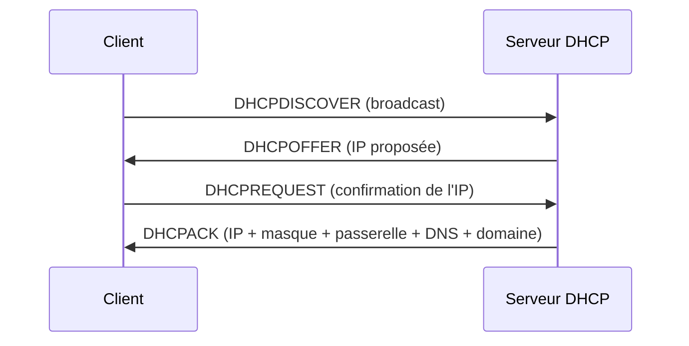
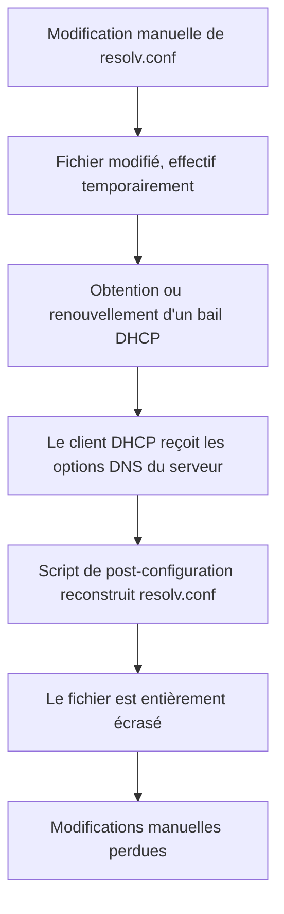
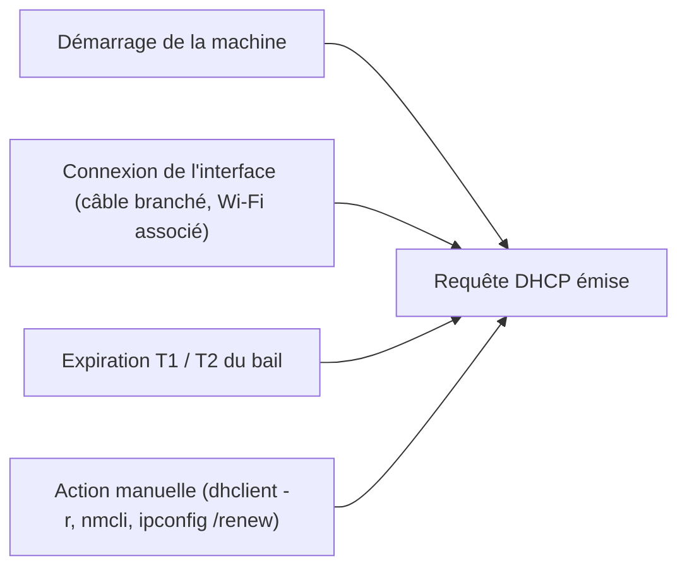
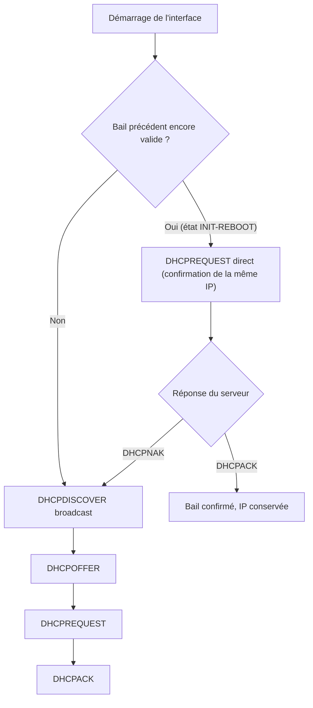

# Module 2 : Adressage réseau

*Cours : [Cours 9 - Les services réseau en environnement Linux](../index.md)*

## 🎯 Objectif du module

_À compléter._

## 🖼️ Résumé visuel

_À compléter. Tu peux utiliser un diagramme Mermaid — voir un exemple de syntaxe dans le module [L'adressage IPv4](../../cours-01-bases-des-reseaux/module-3-l-adressage-ipv4/index.md)._

## 📖 Cours consolidé

_À compléter._

## ✅ Points clés à retenir

_À compléter._

## 📝 Fiche de révision

# DHCP et configuration DNS

## Pourquoi le DHCP fournit aussi la configuration DNS

Le rôle du DHCP ne se limite pas à distribuer une adresse IP. Son objectif est de fournir toute la configuration réseau nécessaire à un poste pour fonctionner de façon autonome, sans intervention manuelle. Lors de la négociation du bail, le serveur transmet, en plus de l'IP et du masque, une série d'options normalisées (RFC 2132) : la passerelle par défaut (option 3), les serveurs DNS (option 6), le nom de domaine (option 15), etc.

Si le DHCP ne fournissait que l'IP, le poste pourrait communiquer par adresse IP mais ne saurait pas vers qui envoyer ses requêtes de résolution de noms. Comme l'objectif du DHCP est justement d'éviter toute configuration manuelle, il est logique que l'adresse des serveurs DNS soit incluse dans le même lot d'informations que l'IP et la passerelle. En environnement Active Directory par exemple, le serveur DNS est souvent le contrôleur de domaine lui-même, ce qui rend la centralisation via le DHCP d'autant plus pertinente : un changement de serveur DNS ne nécessite alors aucune reconfiguration poste par poste.



## Pourquoi /etc/resolv.conf est écrasé sous Linux

Quand l'interface est configurée en DHCP, c'est le client DHCP (`dhclient`, ou `NetworkManager` / `systemd-networkd` selon la distribution) qui gère la négociation du bail. À chaque obtention ou renouvellement de bail, ce client déclenche des scripts qui reconstruisent entièrement `/etc/resolv.conf` à partir des options DNS reçues du serveur (option 6 et option 15). Le fichier est réécrit dans son intégralité, pas fusionné avec son contenu précédent.

C'est pourquoi une modification manuelle de `/etc/resolv.conf` ne survit que jusqu'au prochain déclenchement de ce mécanisme : elle est alors remplacée par la configuration reconstruite depuis le bail DHCP en cours.



Pour imposer un DNS différent de celui distribué par le DHCP tout en restant en IP dynamique, il faut agir au niveau de la configuration de connexion elle-même, par exemple :

```
# Avec NetworkManager
nmcli con mod <connexion> ipv4.dns "1.1.1.1 8.8.8.8"
nmcli con mod <connexion> ipv4.ignore-auto-dns yes

# Avec dhclient (fichier /etc/dhcp/dhclient.conf)
supersede domain-name-servers 1.1.1.1, 8.8.8.8;
```

## Quand une requête DHCP est-elle émise ?

La négociation DHCP est gérée au niveau de l'interface réseau par le système, indépendamment de la session utilisateur. Ouvrir ou fermer une session (verrouiller/déverrouiller, se déconnecter/reconnecter) ne déclenche aucune requête DHCP tant que la machine reste allumée et connectée.

Une requête DHCP est émise dans les cas suivants :

- au démarrage de la machine, lors de l'initialisation de l'interface réseau
- à la connexion physique de l'interface (câble branché, association à un réseau Wi-Fi)
- à l'expiration d'une partie du bail, selon les échéances T1 (~50 % de la durée du bail, renouvellement auprès du serveur d'origine) et T2 (~87,5 %, renouvellement auprès de n'importe quel serveur DHCP disponible)
- sur action manuelle (`dhclient -r` puis relance, `nmcli con up`, `ipconfig /renew`)



## Comportement au redémarrage selon l'état du bail

Au démarrage, le comportement du client dépend de l'existence d'un bail encore valide :

- **Pas de bail connu, ou bail expiré** : le client repart sur la procédure complète — DHCPDISCOVER (broadcast) → DHCPOFFER → DHCPREQUEST → DHCPACK.
- **Bail précédent encore valide (état INIT-REBOOT)** : le client ne repasse pas par le Discover. Il envoie directement un DHCPREQUEST demandant la confirmation de la même adresse IP. Le serveur répond soit par un DHCPACK (bail confirmé, le client garde son IP), soit par un DHCPNAK (IP réattribuée, changement de réseau, bail expiré côté serveur), auquel cas le client repart sur la procédure complète.



## Points essentiels

- Le DHCP distribue l'ensemble de la configuration réseau (IP, masque, passerelle, DNS, domaine), pas seulement l'adresse IP.
- Sous Linux, `/etc/resolv.conf` est régénéré et écrasé à chaque cycle DHCP (obtention ou renouvellement de bail) : toute modification manuelle y est perdue au cycle suivant.
- Pour un DNS personnalisé en IP dynamique, la configuration doit se faire au niveau de la connexion (NetworkManager, `dhclient.conf`), jamais directement dans `/etc/resolv.conf`.
- La requête DHCP est liée au cycle de vie de l'interface réseau (démarrage, connexion, expiration du bail), pas à la session utilisateur.
- Au redémarrage, un bail encore valide permet une confirmation rapide (DHCPREQUEST direct, état INIT-REBOOT) au lieu de la procédure complète en quatre étapes.


## 🧠 Quiz — entraîne-toi

<div id="quiz-cours-09-les-services-reseau-en-environnement-linux-module-2-adressage-reseau"></div>

<script type="application/json" id="quiz-cours-09-les-services-reseau-en-environnement-linux-module-2-adressage-reseau-data">
[
  {
    "question": "Exemple de question à remplacer",
    "options": ["Réponse A", "Réponse B", "Réponse C"],
    "correctIndex": 0,
    "explanation": "Explique ici pourquoi cette réponse est correcte."
  }
]
</script>

<script>
  document.addEventListener("DOMContentLoaded", function () {
    TSSRQuiz.init({
      containerId: "quiz-cours-09-les-services-reseau-en-environnement-linux-module-2-adressage-reseau",
      dataId: "quiz-cours-09-les-services-reseau-en-environnement-linux-module-2-adressage-reseau-data",
    });
  });
</script>
