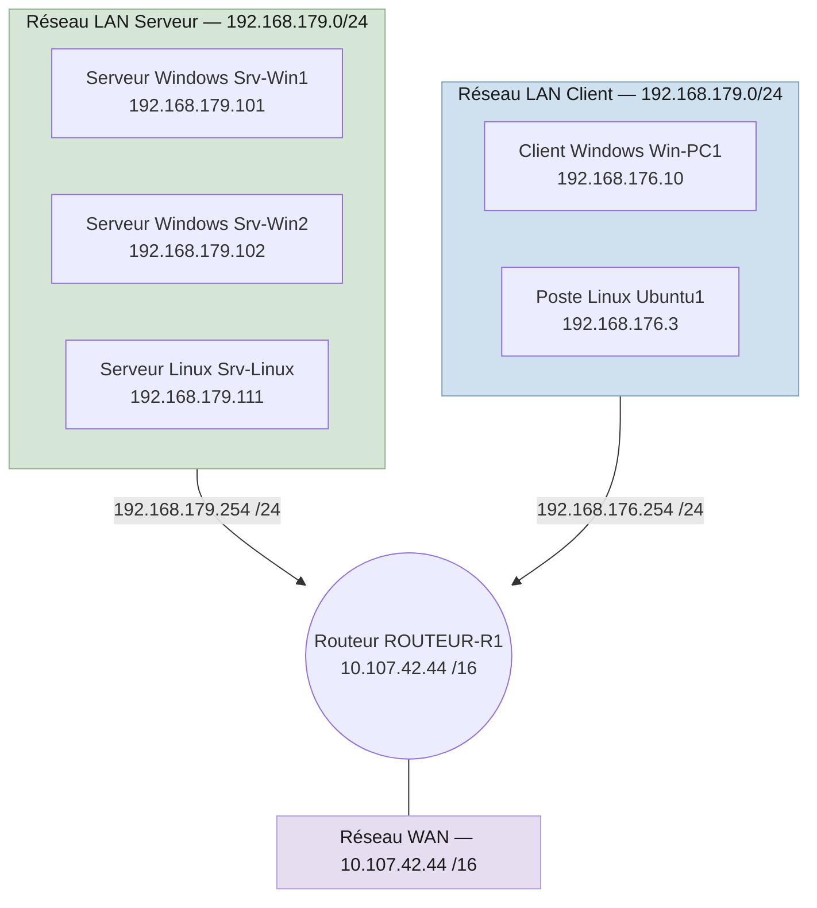

# Cours 10 - Mise en situation professionnelle : service réseau

!!! abstract "Informations pratiques"
    **Dates :** 21/09/2026

    **Formateur(s) :** Cédric RICHEZ

*Ce cours ne comporte pas de modules détaillés dans le référentiel : utilise cette page comme un module unique.*

## 🎯 Support de cours

<iframe class="tssr-pdf-frame" src="mspreseau.pdf"></iframe>

<a href="mspreseau.pdf" target="_blank">📄 Ouvrir le PDF dans un nouvel onglet</a>

## 🖼️ Résumé visuel

Configuration de l'infrastructure

## 📖 Cours consolidé

_À compléter._

## ✅ Points clés à retenir

_À compléter._
