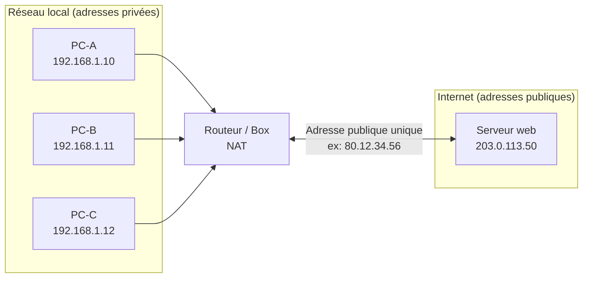
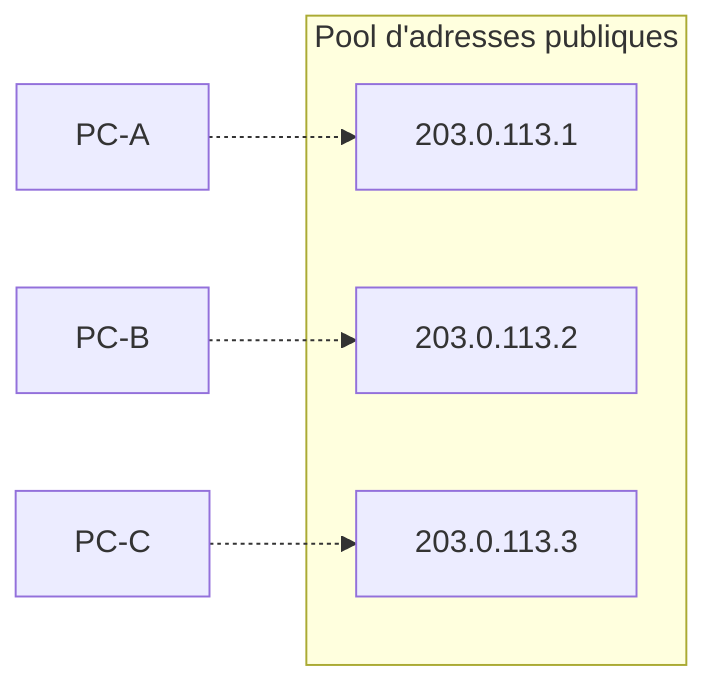
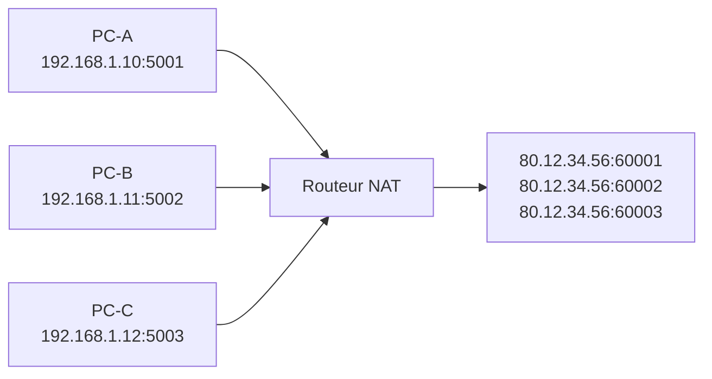
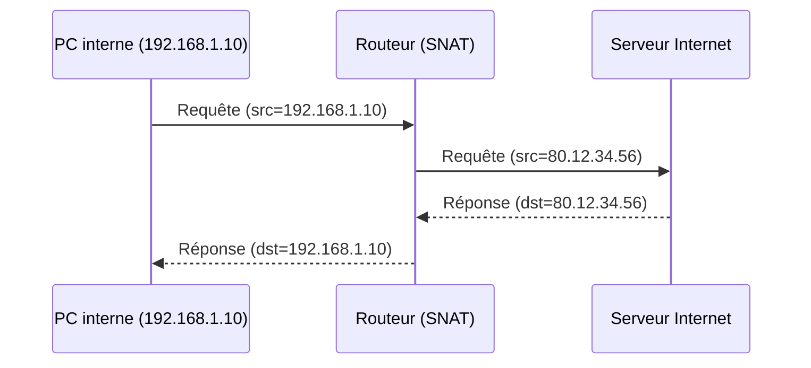
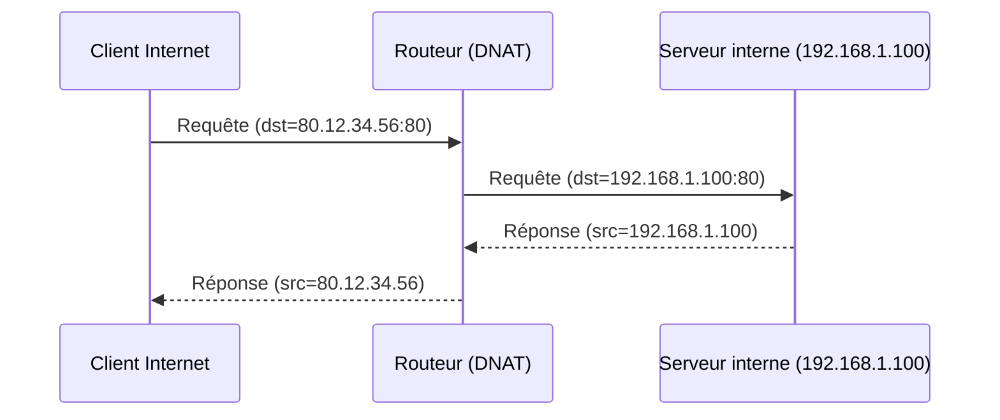

# Fiche de révision — Le NAT (Network Address Translation)

## 1. Définition

Le **NAT** est une technique qui traduit des adresses IP privées (utilisées sur un réseau local) en une ou plusieurs adresses IP publiques (utilisées sur Internet), et inversement. Cette traduction est effectuée par un routeur ou un pare-feu situé à la frontière entre le réseau local et Internet.

**Objectifs principaux :**

| Objectif | Explication |
|---|---|
| Économie d'adresses IPv4 | Plusieurs appareils privés partagent une seule adresse publique |
| Sécurité | Les appareils internes ne sont pas directement joignables depuis l'extérieur |
| Flexibilité | Le plan d'adressage interne peut changer sans impacter l'extérieur |

## 2. Schéma général



Le routeur maintient une **table de traduction** qui associe chaque adresse (et parfois port) interne à une adresse (et port) externe, afin de savoir où renvoyer les réponses.

## 3. Les 3 variantes du NAT

| Variante | Correspondance | Adresse publique | Cas d'usage typique |
|---|---|---|---|
| **NAT statique** | 1 privée ↔ 1 publique, fixe | Une par appareil concerné | Rendre un serveur interne joignable depuis Internet |
| **NAT dynamique** | 1 privée ↔ 1 publique, piochée dans un pool | Plusieurs, en pool | Traduction à la volée sans port, pool limité |
| **PAT (NAT overload)** | Plusieurs privées ↔ 1 publique, via les ports | Une seule pour tout le réseau | Cas le plus courant (box internet, entreprises) |

### 3.1 NAT statique

Association fixe et permanente entre une IP privée et une IP publique.


**Commande Cisco :**
```
ip nat inside source static 192.168.1.100 203.0.113.10
```

### 3.2 NAT dynamique

Le routeur attribue une adresse publique disponible dans un **pool**, à la demande. Si toutes les adresses du pool sont utilisées, les nouvelles connexions attendent.



**Commande Cisco :**
```
ip nat pool MON_POOL 203.0.113.1 203.0.113.3 netmask 255.255.255.0
ip nat inside source list 1 pool MON_POOL
```

### 3.3 PAT / NAT overload

Tous les appareils partagent **une seule adresse publique**, différenciés par leur **numéro de port**.



| IP privée | Port privé | IP publique | Port public |
|---|---|---|---|
| 192.168.1.10 | 5001 | 80.12.34.56 | 60001 |
| 192.168.1.11 | 5002 | 80.12.34.56 | 60002 |
| 192.168.1.12 | 5003 | 80.12.34.56 | 60003 |

**Commande Cisco :**
```
ip nat inside source list 1 interface GigabitEthernet0/0 overload
```

## 4. SNAT vs DNAT

Le NAT peut traduire l'adresse **source** ou l'adresse **destination** d'un paquet. Ce sont deux logiques différentes, souvent confondues.

| | SNAT (Source NAT) | DNAT (Destination NAT) |
|---|---|---|
| Adresse modifiée | Adresse **source** du paquet | Adresse **destination** du paquet |
| Sens du trafic | Sortant (LAN → Internet) | Entrant (Internet → LAN) |
| Quand ça agit | Au moment où le paquet **quitte** le réseau local | Au moment où le paquet **entre** dans le réseau local |
| Exemple concret | Un PC interne navigue sur Internet : son IP privée devient l'IP publique de la box | Un serveur web interne reçoit des requêtes : l'IP publique de la box est redirigée vers l'IP privée du serveur |
| Autre nom | NAT "inside source" | Port forwarding / redirection de port |

### 4.1 SNAT — traduction de la source (trafic sortant)



### 4.2 DNAT — traduction de la destination (trafic entrant)



**Astuce mnémotechnique :** SNAT modifie la **S**ource, généralement pour du trafic **S**ortant. DNAT modifie la **D**estination, généralement pour rediriger vers un serveur (ex: **D**MZ).

## 5. Résumé express

| Concept | Type de NAT associé | Relation |
|---|---|---|
| 1 privée ↔ 1 publique fixe | NAT statique | = souvent du DNAT (serveur exposé) |
| 1 privée ↔ 1 publique du pool | NAT dynamique | = SNAT |
| N privées ↔ 1 publique via ports | PAT / overload | = SNAT (le plus répandu) |

**À retenir pour l'examen :**
- Le NAT résout la pénurie d'IPv4 et masque le plan d'adressage interne.
- PAT est la variante la plus utilisée car elle ne consomme qu'une seule IP publique.
- SNAT = trafic sortant, adresse source modifiée. DNAT = trafic entrant, adresse destination modifiée (port forwarding).
- Sur Cisco, toujours définir les interfaces `ip nat inside` / `ip nat outside` avant d'appliquer une règle NAT.
