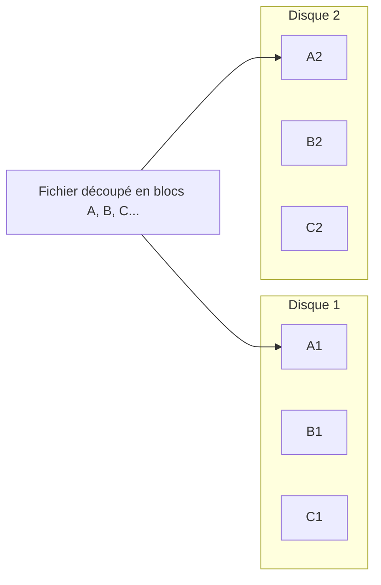
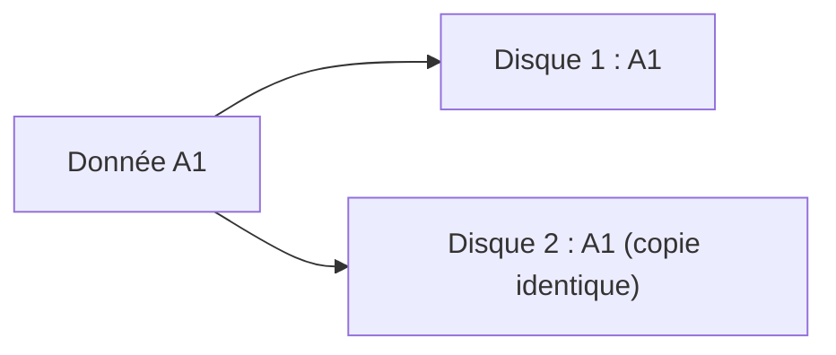
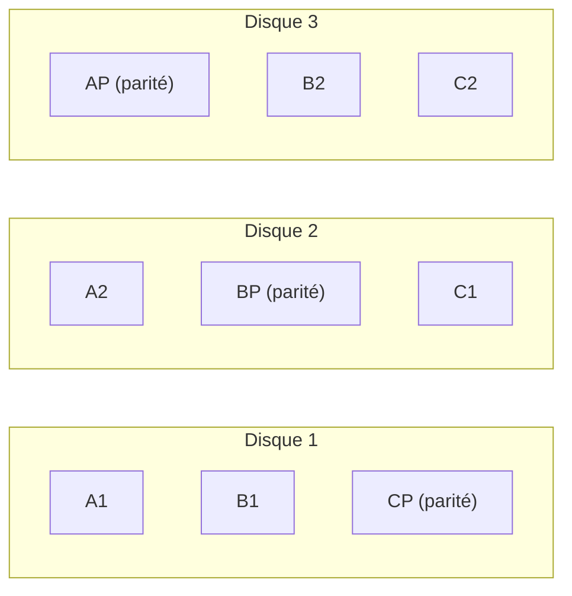
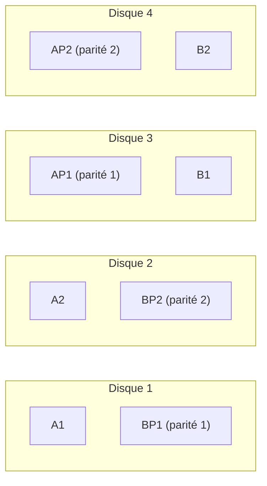
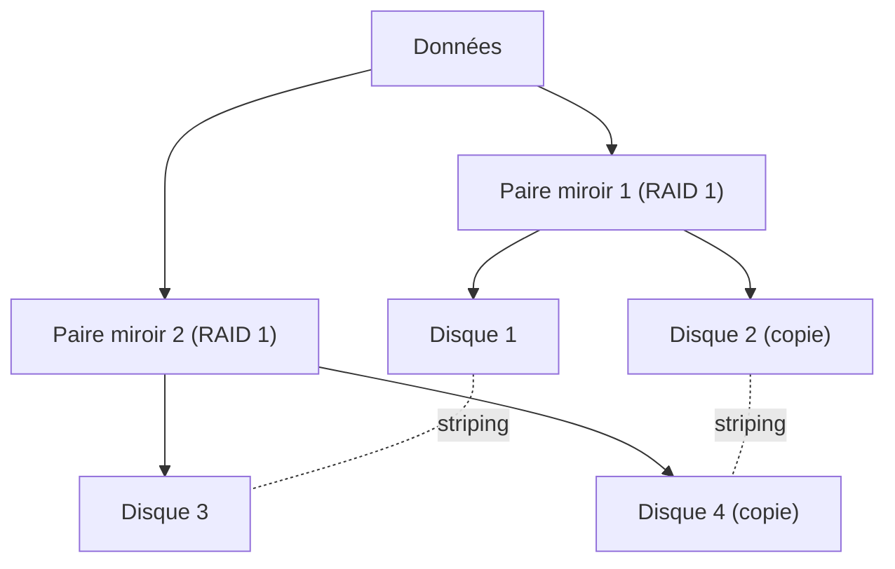
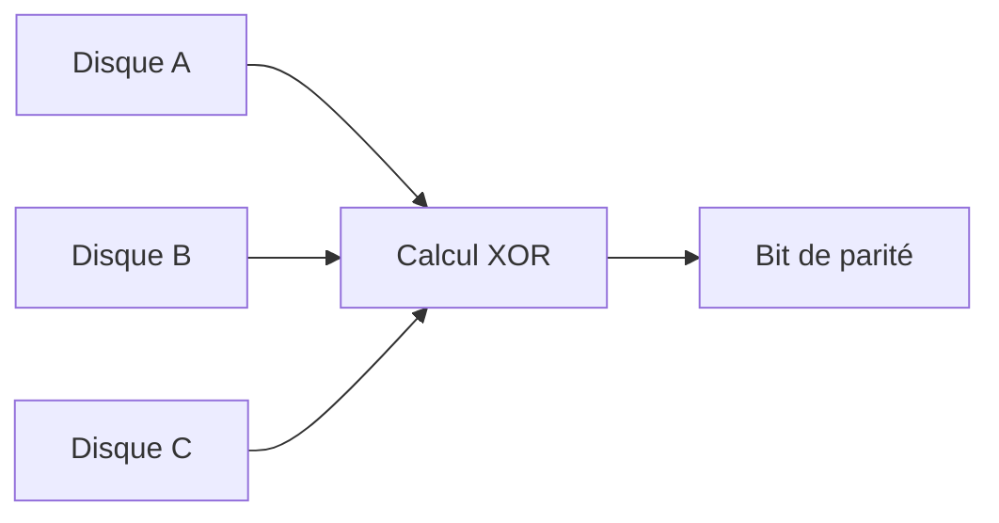
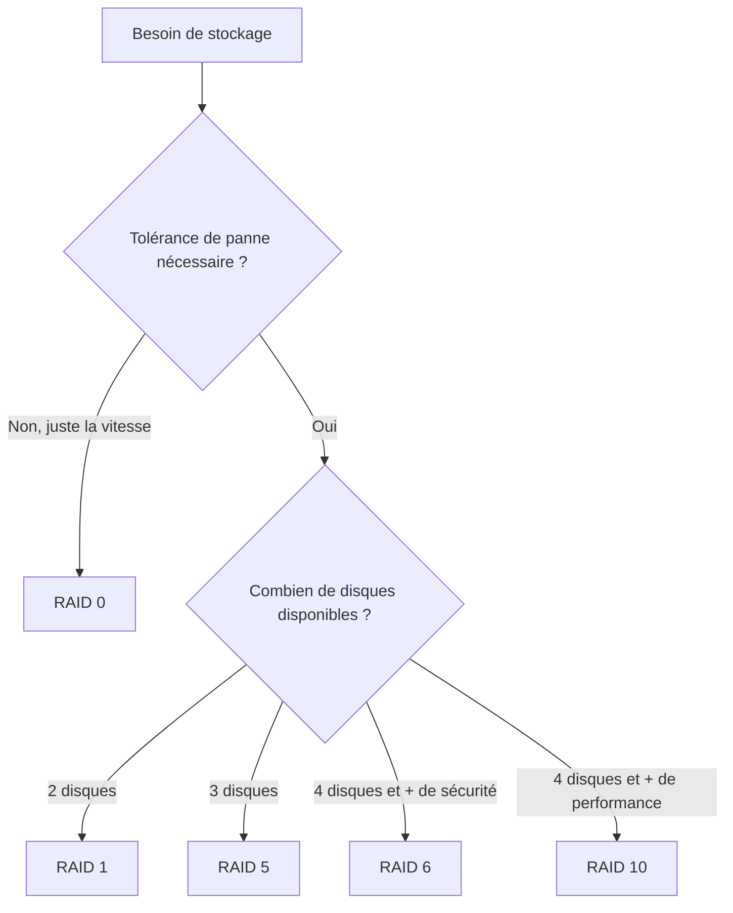

# Fiche de révision – Le RAID (Module 1, Administration Windows)

## 1. Qu'est-ce que le RAID ?

**RAID** = *Redundant Array of Independent (Inexpensive) Disks*.

Objectif : combiner plusieurs disques physiques pour améliorer soit la **performance**, soit la **tolérance aux pannes** (ou les deux, selon le niveau choisi).

> ⚠️ **Le RAID n'est pas un backup !**
> Il protège contre la panne matérielle d'un disque, pas contre une suppression accidentelle, un ransomware ou une erreur humaine.

Logique de disponibilité : si un disque casse, on a le temps de le remplacer pendant que le service continue de fonctionner pour les utilisateurs.

**Différence clé en cas de remplacement de disque :**
- En **RAID 1** → on **recopie** le disque restant.
- En **RAID 5** (et les autres RAID à parité) → on **reconstruit** les données à partir de la parité.

---

## 2. RAID matériel vs RAID logiciel

| Type | Principe |
|---|---|
| **RAID matériel** | Géré par une carte RAID dédiée (contexte entreprise, on parle de « RAID machine ») |
| **RAID logiciel (Windows)** | Géré via les **disques dynamiques** et les **volumes** (le RAID logiciel a besoin d'un volume, pas d'une simple partition) |

Rappel disques :
- **Configuration de base** → partitions, un seul disque physique par partition, gestion simple. Pas de RAID logiciel possible.
- **Configuration dynamique** → volumes, gestion à travers plusieurs disques. C'est elle qui permet le RAID logiciel Windows.

---

## 3. Vue d'ensemble des niveaux de RAID

| RAID | Définition | Nombre min. de disques | Capacité utile | Utilité principale |
|---|---|---|---|---|
| **RAID 0** | Striping (répartition) | 2 | 100 % | Performance |
| **RAID 1** | Mirroring (duplication) | 2 | 50 % | Sécurité des données |
| **RAID 5** | Striping + parité distribuée | 3 | (n-1)/n | Serveurs de fichiers, stockage général |
| **RAID 6** | Striping + double parité | 4 | (n-2)/n | Stockage nécessitant une forte tolérance aux pannes |
| **RAID 10** | Mirroring + Striping | 4 | 50 % | Bases de données, virtualisation, applications exigeantes |

**Moyen mnémotechnique :**
- RAID 0 → **vitesse**, zéro sécurité
- RAID 1 → **sécurité simple**, on « recopie »
- RAID 5 → **compromis**, on « reconstruit » grâce à la parité
- RAID 6 → RAID 5 en plus solide (2 pannes tolérées)
- RAID 10 → le « meilleur des deux mondes », mais coûteux en disques

---

## 4. Détail de chaque niveau de RAID

### 🔹 RAID 0 — Volume agrégé par bandes (striping)

Les données sont **découpées en blocs** et réparties sur l'ensemble des disques (au minimum 2). Il n'y a **aucune redondance** : chaque bloc n'existe qu'à un seul endroit.



*Donnée A est écrite sur le disque 1, la donnée suivante sur le disque 2, et ainsi de suite.*

| Avantages | Inconvénients |
|---|---|
| 🚀 Très bonnes performances en lecture/écriture | ❌ Aucune tolérance aux pannes |
| 💰 100 % de la capacité disponible | ❌ La panne d'un seul disque fait perdre **tout le RAID** |

**Point de vigilance :** les disques doivent être de **taille égale**.

---

### 🔹 RAID 1 — Volume en miroir (mirroring)

Les **mêmes données** sont écrites **simultanément** sur 2 disques identiques. Il ne s'agit pas de répartition mais bien d'une copie intégrale.



*Si on a deux disques de 100 Go, on n'obtient pas 200 Go de capacité logique mais 100 Go, car l'autre moitié sert à la tolérance de panne.*

| Avantages | Inconvénients |
|---|---|
| 🛡️ Résiste à la panne d'un disque | ❌ 50 % de la capacité seulement est utilisable |
| 🔄 Lecture parfois améliorée | ❌ Coût élevé en stockage |
| 🧩 Simple à comprendre et à reconstruire (on recopie) | |

---

### 🔹 RAID 5 — Volume agrégé par bandes avec parité

Minimum **3 disques de même taille**. Les données **et** les informations de parité sont réparties sur **tous** les disques (la parité n'est pas figée sur un seul disque dédié).



*Exemple du cours : A1, A2, AP, B1, B2, BP, C1, C2, CP sont des données écrites sur différents disques — remarque comment la parité (AP, BP, CP) change de disque à chaque ligne.*

**Capacité :** avec 3 disques de 1 To, on n'a pas 3 To mais **2 To**, car l'équivalent d'1 disque est dédié à la parité (répartie sur les 3, pas concentrée sur un seul).

| Avantages | Inconvénients |
|---|---|
| ⚖️ Bon compromis capacité / sécurité / performances | ❌ Écritures plus lentes (calcul de parité) |
| 🛡️ Supporte la panne d'**1 disque** | ❌ Reconstruction longue après panne |
| 💾 Meilleur rendement que RAID 1 | ❌ Si un 2ᵉ disque tombe pendant la reconstruction → perte du RAID |

---

### 🔹 RAID 6 — Striping + double parité

Identique au RAID 5, mais avec **deux informations de parité** distinctes, ce qui permet de survivre à **2 pannes simultanées**. Nécessite au minimum **4 disques**.



| Avantages | Inconvénients |
|---|---|
| 🛡️ Supporte la panne de **2 disques** simultanément | ❌ Écritures encore plus lentes |
| 💾 Bonne capacité utile | ❌ Calcul de parité plus important |
| | ❌ Reconstruction longue, minimum 4 disques |

---

### 🔹 RAID 10 (1+0) — Mirroring + Striping

Combine RAID 1 et RAID 0 : les données sont d'abord **dupliquées** par paires (RAID 1), puis ces paires sont **réparties** (RAID 0). Minimum **4 disques**.



| Avantages | Inconvénients |
|---|---|
| 🚀 Excellentes performances | ❌ Seulement **50 % de capacité utile** |
| 🛡️ Bonne tolérance aux pannes | ❌ Nécessite au minimum 4 disques |
| ⚡ Reconstructions généralement plus rapides que RAID 5/6 | ❌ Coût élevé |

---

## 5. Le mécanisme de la parité en détail (RAID 5)

La parité **n'est pas une copie** des données (contrairement au RAID 1) : c'est une **information calculée**, une donnée de contrôle qui permet de retrouver une donnée manquante.

### Exemple simplifié (logique d'addition, pas le vrai calcul)
```
Donnée A = 10
Donnée B = 20
Donnée C = 30
Parité = 10 + 20 + 30 = 60
```
Si B disparaît → `60 - 10 - 30 = 20` → donnée reconstituée.

### Le vrai calcul : le XOR (OU exclusif)

| A | B | A XOR B |
|---|---|---|
| 0 | 0 | **0** |
| 0 | 1 | **1** |
| 1 | 0 | **1** |
| 1 | 1 | **0** |

**À retenir : XOR donne 1 quand les deux bits sont différents.**



Si un disque tombe, on refait un XOR entre les disques restants et la parité pour retrouver le bit manquant.

---

## 6. Schéma de synthèse — quel RAID choisir ?


