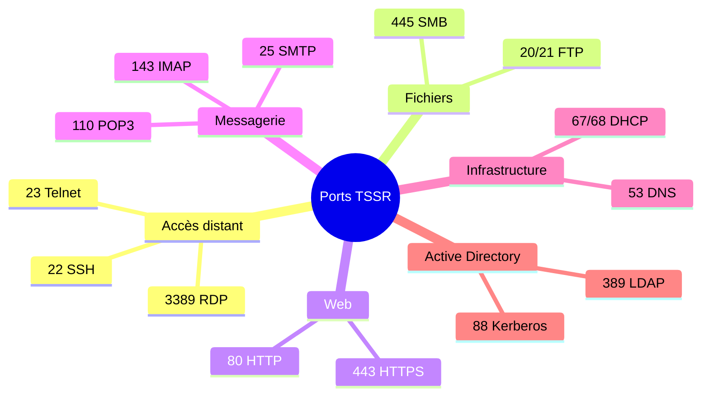

# 🔌 Ports à connaître pour l'examen TSSR

## Vue d'ensemble par catégorie

## Tableau détaillé

| Port | Proto | Service | Signification |
|:---:|:---:|---|---|
| **20 / 21** | TCP | FTP | Transfert de fichiers non chiffré (20 = données, 21 = commandes) |
| **22** | TCP | SSH | Administration à distance chiffrée, SFTP, SCP |
| **23** | TCP | Telnet | Accès distant non chiffré (obsolète) |
| **25** | TCP | SMTP | Envoi de mails entre serveurs |
| **53** | UDP/TCP | DNS | Résolution de noms en adresses IP |
| **67 / 68** | UDP | DHCP | Attribution automatique d'IP (67 = serveur, 68 = client) |
| **80** | TCP | HTTP | Web non chiffré |
| **88** | TCP/UDP | Kerberos | Authentification Active Directory |
| **110** | TCP | POP3 | Récupération des mails (téléchargés puis supprimés du serveur) |
| **143** | TCP | IMAP | Consultation des mails synchronisée avec le serveur |
| **389** | TCP/UDP | LDAP | Interrogation de l'annuaire (Active Directory) |
| **443** | TCP | HTTPS | Web chiffré (TLS) |
| **445** | TCP | SMB | Partage de fichiers et d'imprimantes Windows |
| **3389** | TCP | RDP | Bureau à distance Windows |

## 💡 Astuces mémo

- **UDP** pour l'infrastructure qui doit être rapide (DNS, DHCP).
- **TCP** pour les services qui ont besoin de fiabilité (web, mail, SSH).
- Le **« S »** final (HTTPS, LDAPS, IMAPS…) indique la version chiffrée par TLS.
- Plages : ports bien connus **0-1023**, enregistrés **1024-49151**, dynamiques **49152-65535**.
